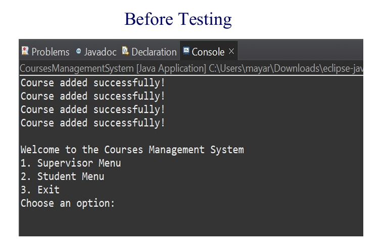
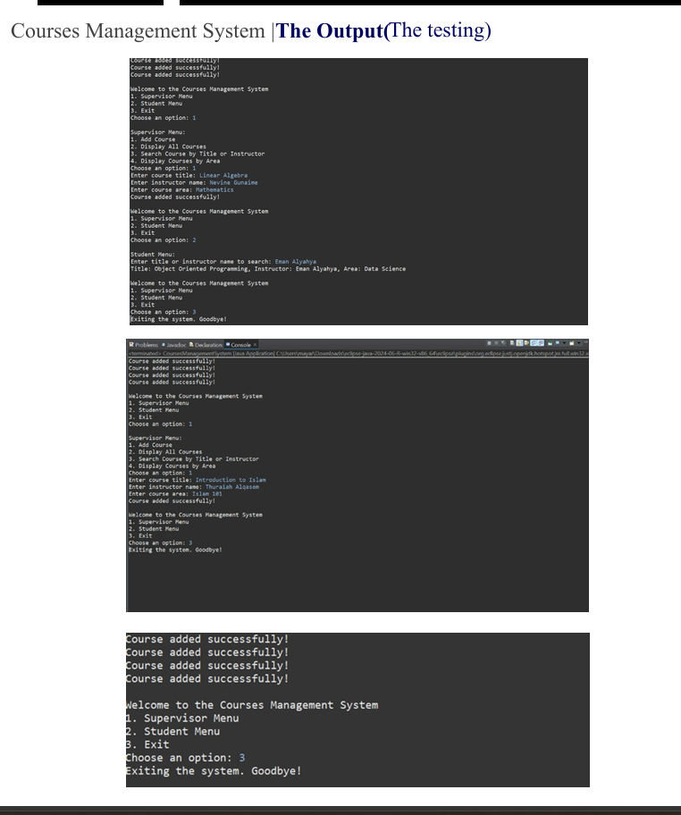
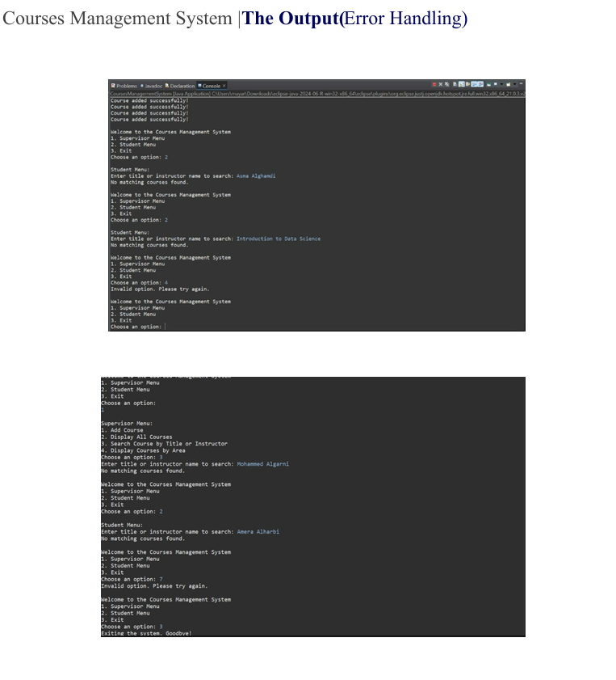

# Courses Management System (Java)

##  Overview
A command-line based Courses Management System developed in Java. The system allows supervisors to manage courses and enables students to browse and search for courses efficiently.

##  Features
- Add new courses to the system
- Display all available courses
- Search courses by:
  - Title
  - Instructor name
  - Course area
- Browse courses by category
- Interactive Command-Line Interface (CLI)
- Basic error handling for invalid inputs

##  Technologies Used
- Java
- Object-Oriented Programming (OOP)
- Data Structures (Lists)

##  Key Concepts Applied
- Class design (Course, Supervisor)
- Encapsulation (Getters & Setters)
- Search functionality implementation
- CLI-based user interaction
- Data handling using collections

##  How to Run
1. Open the project in any Java IDE (e.g., IntelliJ, Eclipse)  
2. Run the `Main` class  
3. Use the CLI menu to test all functionalities

## Sample Outputs

### 🔹 Before Testing (Initial Run)

### 🔹 During Testing (System Functionality)

### 🔹 Error Handling Example

##  Full Code & Screenshots
For all code files and program outputs, check the project report:  
[View Project Report](./Courses_Management_Report.pdf)

## Author
Arwa Alyami  
Developed as part of a university group project (3–4 students)
